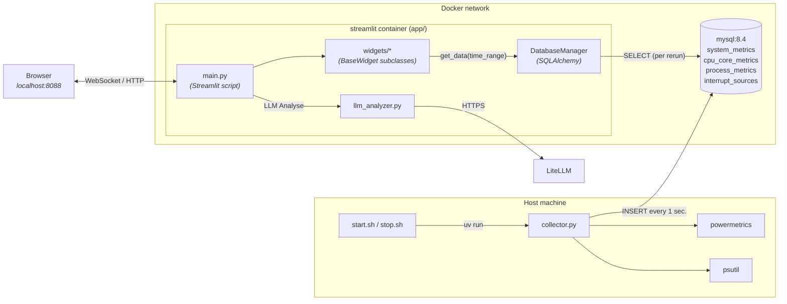
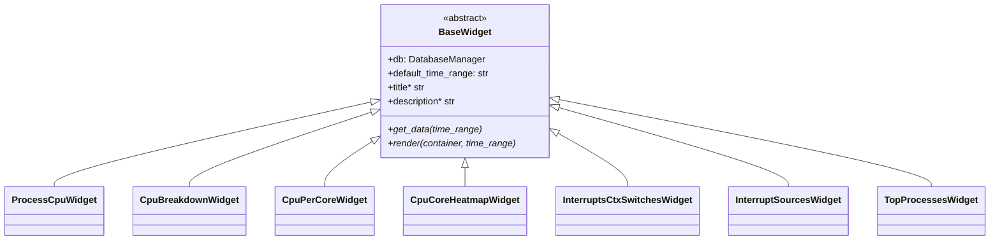

## Container diagram

The collector runs natively
on the host (it needs `psutil`, `ps`, and `sudo powermetrics`), while MySQL and the
Streamlit app run in Docker.

## Widget class hierarchy

Every chart on the page is a `BaseWidget` subclass. `main.py` instantiates each one with the shared
`DatabaseManager` and calls `render(container, time_range)` to display the widget.

